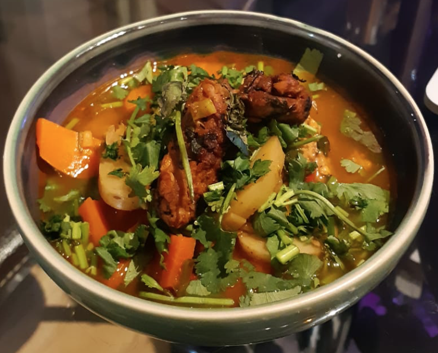

# Thai-ish Tempeh Leftover Soup

A lovely Thai-ish leftover soup which uses Tempeh, inspired by [this recipe](https://www.foodandspice.com/2012/09/thai-red-curry-tempeh-soup.html).

Had lots of fresh coriander left over, as well as potatoes and carrots, so decided to use it up in a spicy soup! It turned out much better than expected.

Choice quote upon driptap's tasting of it: *"Did you put MSG in this?"*

## For teh tempeh

- 200g tempeh *cut into strips*
- 6 tbsp of tamari (or soy) sauce
- 3 tbs of sesame oil
- juice from 1 [citron](https://en.wikipedia.org/wiki/Citron) (a lime will do if you can't find one - a good London cornershop/produce market will have this)
- a small bunch of fresh coriander *finely chopped*
- sesame oil for frying - enough to make teh tempeh crispy!
- sea salt and pepper to taste

## For the soup

- 3 tbsp coconut oil
- 2 tbsp garlic infused olive oil
- 1 tbsp sesame oil- 3-4 cloves garlic *finely chopped*
- 0.5-1 large white onion *finely chopped*
- 3-4 cloves of garlic *finely chopped*
- 3-4 fresh chillis *finely chopped* - can be whatever spice level you like!
- a small cube of ginger *finely chopped or grated*
- 2-3 x small bunch of fresh coriander *finely chopped* - I had so much coriander I wanted to use it all! Some for frying for the soup base, some for in the soup and some for garnish
- 1 tsp ground coriander
- 1 tsp ground cumin
- 2 tsp miso paste
- 2-3 tbsp of [Thai red curry paste](https://www.thai-food-online.co.uk/products/thai-red-curry-paste-400g-maeploy)
- 1.5L-2L of broth (if you add too much, you can boil it off)
- 2-3 tsp of brown sugar (or any sugar if you have in your cupboard)
- 2 tbsp of tamari (or soy) sauce
- zest and juice from 1 citron (or lime)
- vegetables *roughly chopped* - this is the leftover part, feel free to use whatever you have - potatoes, carrots, mushrooms, green beans, peppers, noodles etc.
- nuts (cashews, peanuts, whatever you have)
- fresh basil leaves for garnish

## Instructions

Note that as this recipe was concieved to use up a lot of leftovers, you are encouraged to experiment with proportions, ratios and ingredients until you find your favourite version!

### For the tempeh

Make a marinade for the tempeh by mixing the tamari or soy sauce, sesame oil, citron juice and fresh coriander in a suitable container (helps if you can seal it and shake it without it making a mess). Toss the tempeh strips in and shake it around (you can be more delicate but it's not as fun). Let it marinade in the fridge for as long as you finish chopping the bits for the soup, shaking/mixing occasionally.

In a large heavy pan, heat the sesame oil over medium heat. Once hot, add the tempeh, leaving any leftover marinade to use for the soup base. Fry, flipping every few minutes, until the tempeh is nicely browned and crispy on both sides. Add more oil if necessary. I usually just leave it on the pan and turn off the heat, but you can also transfer the tempeh to a bowl, pat off any excess oil with paper towels and gently toss with a few sprinkles of sea salt. In any case, leave it for a bit.

### For the soup

Make the soup base by heating the coconut oil, garlic infused olive oil (or just normal olive oil, or just use more of the other oils if you don't have either) and sesame oil over medium heat. When hot, add the onions, ginger, fresh chillies, garlic and a small bunch of chopped coriander. Stir (and keep stirring) and cook for 5 minutes or so, until the onions soften a bit. Put in the spices, miso paste and red curry paste and keep stirring for a minute or too.

Add in about half the broth and bring to a simmer for a few minutes, stirring occasionally. Make sure the miso and curry paste have dissolved nicely. Add the sugar, tamari or soy sauce, citron juice and zest and the rest of the broth and bring to boil.

Put in the vegetables (I used potatoes and carrots) and bring to a boil. If you've not added too much broth, then lower the heat to a simmer and cover for 10-15 minutes. Otherwise keep boiling the broth off, stirring occasionally. Some way through the cooking time, add the prepared tempeh and more chopped coriander, saving some tempeh pieces for garnish. Add some more citron juice and fresh coriander a few minutes before you want to eat.

Ladle into bowls and garnish with remaining tempeh, fresh basil and nuts.

Makes a bunch of soup, probably enough for 4-5 decent sized bowls, but I ate 3 in one night because it was so good!

[__\.\.\.back__](../../readme.md)
